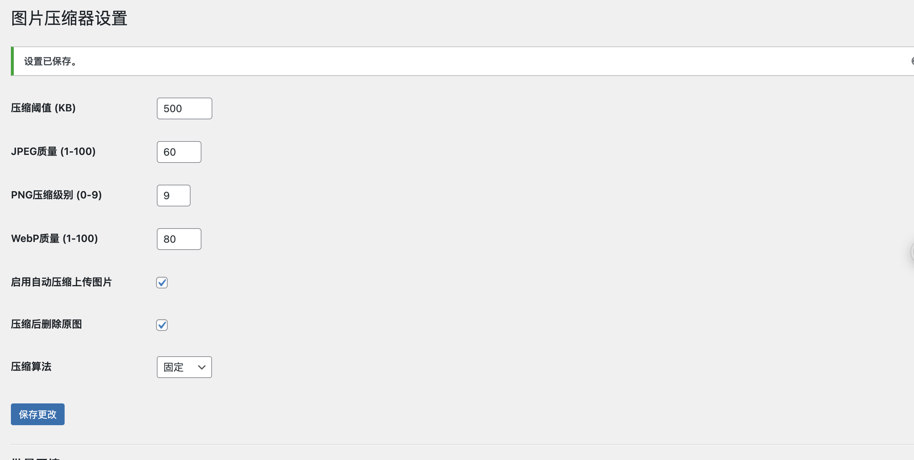

# 智能图片压缩器 (Smart Image Compressor)

 
 
 

一个强大的WordPress图片压缩插件，可自动优化上传的图片，减少网站加载时间，节省服务器空间。

## 功能特点

- 📦 自动压缩上传的图片
- 🖼️ 支持多种图片格式：JPEG、PNG、GIF、WebP、BMP、TIFF、ICO
- ⚡ 智能压缩算法，图片越大压缩率越高
- 🔄 支持批量压缩现有媒体库
- 📊 详细的压缩统计和日志
- 🛠️ 可自定义压缩参数
- 🚀 轻量级，不影响网站性能

## 安装

1. 下载最新版本的插件 ZIP 文件
2. 在WordPress后台，转到 插件 > 添加新 > 上传插件
3. 上传下载的ZIP文件
4. 点击"立即安装"，然后点击"启用插件"

或者通过FTP上传：

1. 解压下载的ZIP文件
2. 将 `smart-image-compressor` 文件夹上传到 `/wp-content/plugins/` 目录
3. 在WordPress后台的"插件"菜单中激活插件

## 使用方法

### 自动压缩

1. 插件激活后，默认会自动压缩新上传的图片
2. 您可以在 媒体 > 图片压缩器 中调整压缩设置

### 批量压缩现有图片

1. 转到 媒体 > 图片压缩器
2. 点击"开始批量压缩"按钮
3. 等待处理完成

### 压缩设置

在 媒体 > 图片压缩器 页面，您可以配置以下选项：

- 压缩阈值 (KB)
- JPEG质量 (1-100)
- PNG压缩级别 (0-9)
- WebP质量 (1-100)
- 启用/禁用自动压缩
- 压缩算法选择

## 支持的图片格式

- JPEG/JPG
- PNG
- GIF (静态)
- WebP
- BMP
- TIFF
- ICO

## 系统要求

- WordPress 5.0 或更高版本
- PHP 7.4 或更高版本
- GD库 或 Imagick 扩展（推荐）

## 常见问题

### 压缩会影响图片质量吗？

我们使用智能算法，在保证视觉质量的同时尽可能减小文件大小。您可以在设置中调整压缩级别。

### 支持多站点吗？

是的，插件完全支持WordPress多站点网络。

### 如何查看压缩统计？

转到 媒体 > 压缩日志 查看详细的压缩统计和日志。

## 贡献

欢迎提交 Issue 和 Pull Request。

## 许可证

GPL-2.0+

## 更新日志

### 1.0.0
* 初始发布

## 关于作者

由 [IT小埋](https://github.com/username) 开发。

---

⭐ 如果这个插件对您有帮助，请考虑给它一个星标！

